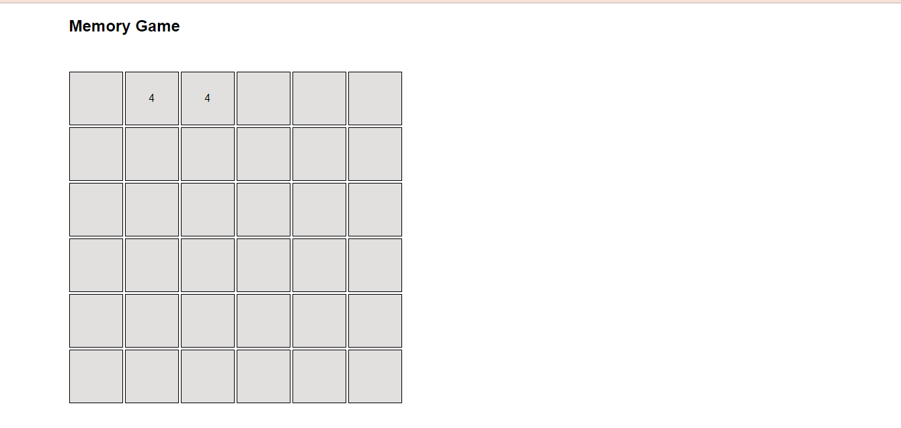

# Mini_Projects_React
Description: This repository contains two mini projects developed using React: a Memory Game and a Gallery Image App that uses the Pixabay API to fetch images based on user searches.

# Memory Game
Description: The Memory Game is a classic card-matching game where players need to flip cards to find pairs. It tests memory and concentration skills.

Features:
grid size (6 X 6).

## Screenshots:

# Gallery Image App
Description: The Gallery Image App allows users to search for specific images using the Pixabay API. Users can enter search queries, and the app will display relevant images.

## Features:

 - Search for images by entering keywords.
 - Display search results in a grid layout.
 - Responsive design for various screen sizes.

## Screenshots:

# Installation
 1. Clone this repository: git clone https://github.com/mmahareeq/Mini_Projects_React.git
 2. Navigate to the project folder: cd Mini_Projects_React
 3. Install dependencies: npm install

# Usage
## Memory Game
  1. Navigate to the Memory Game directory: cd memory_game
  2. Run the app: npm start
## Gallery Image App
  1. Navigate to the Gallery Image App directory: cd gallery-image-app
  2. Run the app: npm start

# Technologies Used
 1. React
 2. Pixabay API (for the Gallery Image App) https://pixabay.com/api/docs/
